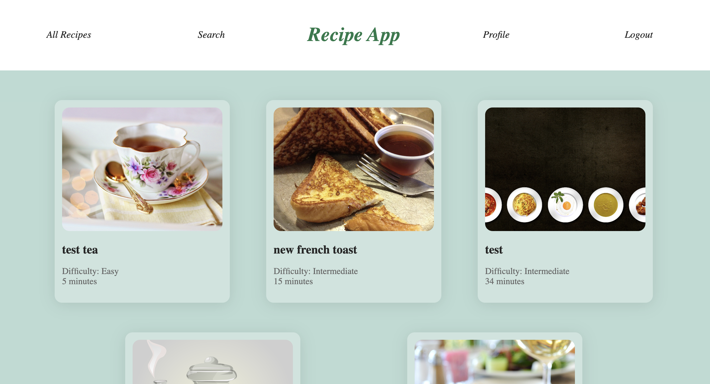
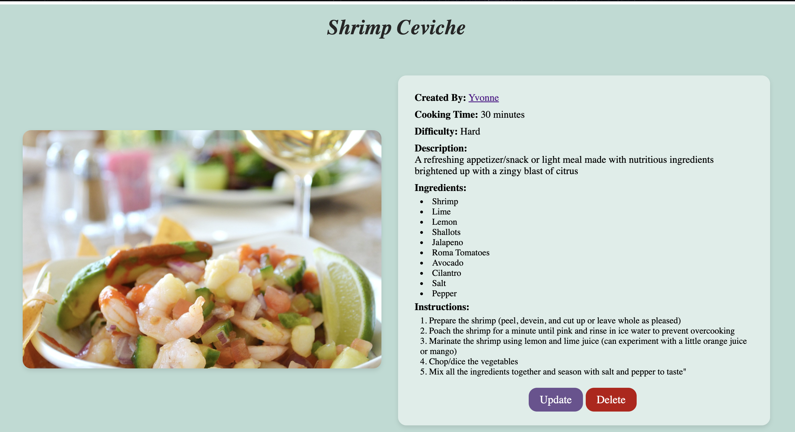
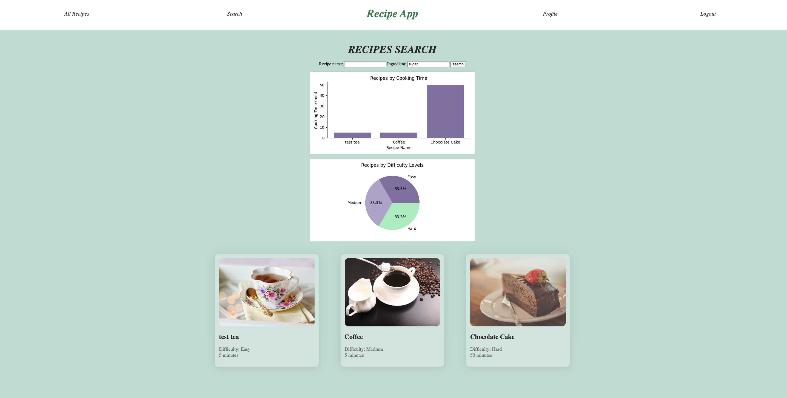
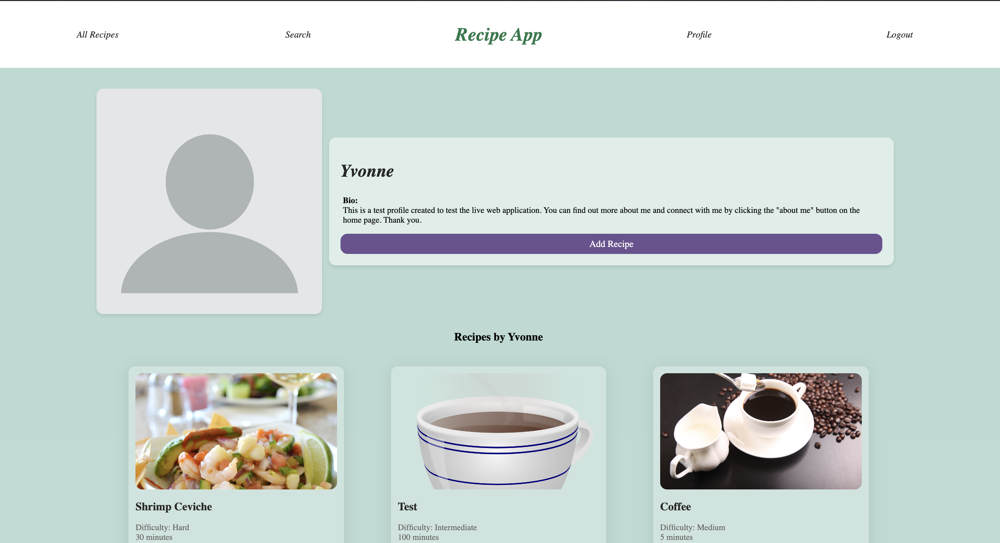

# Recipe App (Web Application Version)

Hosted on Koyeb: [https://sensible-elva-yuxu1-946856e4.koyeb.app/](https://sensible-elva-yuxu1-946856e4.koyeb.app/)

## Objective:
Use the Django web framework to develop a web application version of a recipe app, which is able to create, read, and modify recipes, as well as allow for searching of recipes based on ingredients. The application would have multiple users and an admin panel.

## Key Features:
* Allow for user signup, authentication, login and logout.
* Allow users to create new recipes.
* Automatically rate each recipe by difficulty level.
* Receive user input and handle errors appropriately.
* Allow users to update and delete recipes created by themselves.
* Let users search for recipes according to name and/or ingredients.
* Show statistics and visualizations based on trends and data analysis.
* Display more details on each recipe if the user asks for that.
* Allow users to view a profile page of other users, including that user's recipes.
* Include a Django Admin dashboard for working with database entries.

## Technologies
* Python (version 3.8)
* Django (version 3)
* virtualenvwrapper (create and manage virtual environments)
* pip (install and manage packages)
* SQLite3 database (for app development)
* PostgreSQL database (for production/live app)
* pandas (Python library for data handling and analysis)
* matplotlib (library for data visualization and charting)
* Koyeb (hosting platform for web service and database)
* WhiteNoise (serving static files)
* Cloudinary (serving media files)
